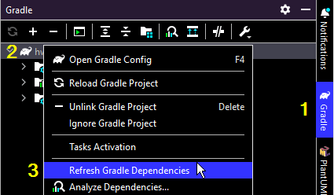

# Jacquard Examples

[Jacquard](https://github.com/espertus/jacquard) [[Javadoc](https://ellenspertus.com/jacquard/)]
is a Java autograder for
Gradescope. This repo is for sample graders illustrating how to use Jacquard.

## Video Instructions

For video instructions, see the [Getting started with Jacquard Quiz 1 playlist](
https://northeastern.hosted.panopto.com/Panopto/Pages/Viewer.aspx?pid=c1dee1d0-d598-487f-8067-b06001175c50)
or select individual videos:

1. [Downloading Jacquard examples](https://northeastern.hosted.panopto.com/Panopto/Pages/Viewer.aspx?pid=c1dee1d0-d598-487f-8067-b06001175c50)
   (0:44)
2. [Opening Quiz 1 example in IntelliJ](https://northeastern.hosted.panopto.com/Panopto/Pages/Viewer.aspx?id=9d058c84-4bbf-4a23-8ff6-b0600110b1ed)
   (0:54)
3. [Viewing student instructions for Quiz 1](https://northeastern.hosted.panopto.com/Panopto/Pages/Viewer.aspx?id=ee302e80-84d0-4015-872c-b0600110b580)
   (1:21)
4. [Viewing starter code and tests (and setting JDK)](https://northeastern.hosted.panopto.com/Panopto/Pages/Viewer.aspx?id=a2b356d7-f5dd-4c4f-8b26-b0600110b1b5)
   (2:30)
5. [Viewing main grader code for Quiz 1](https://northeastern.hosted.panopto.com/Panopto/Pages/Viewer.aspx?id=885d620b-2728-4fb5-96e5-b06001147c57)
   (5:26)
6. [Running the autograder locally](https://northeastern.hosted.panopto.com/Panopto/Pages/Viewer.aspx?id=68d127f1-86ec-4cdc-a110-b06001339b3a)
   (1:46)
7. [Testing and building autograder zip file (Windows)](https://northeastern.hosted.panopto.com/Panopto/Pages/Viewer.aspx?id=ee6bc091-4d92-42e5-8eb3-b0600155f875) (
   1:22)
   or [Testing and building autograder zip file (Mac)](https://northeastern.hosted.panopto.com/Panopto/Pages/Viewer.aspx?id=6ceb45d9-bf75-4f7d-b7f5-b06501518e45)
   (0:58)
8. [Creating assignment on Gradescope](https://northeastern.hosted.panopto.com/Panopto/Pages/Viewer.aspx?id=cd3b672d-5be6-4af4-af18-b0600156675c)
   (0:52)
9. [Uploading and testing autograder](https://northeastern.hosted.panopto.com/Panopto/Pages/Viewer.aspx?id=9742091c-558a-46be-8cb4-b06001565d99)
   (2:14)
10. [Refreshing the Jacquard library](https://northeastern.hosted.panopto.com/Panopto/Pages/Viewer.aspx?id=8578e267-2bf0-4849-94c0-b066015c1ee3) (0:24)

## Examples

There are two examples, both from a CS 2 data structures course. Quiz 1 should be viewed first.

[Quiz 1](quiz1/README.md) demonstrates these features, applied to a single submitted file.

* Checkstyle tests
* PMD tests (using a single rule from a single ruleset)
* Parser-based tests (ensuring that language features are used as required)
* JUnit tests

[Homework 1](hw1/README.md) requires students to complete the implementation
of two classes and write unit tests. It demonstrates these features:

* Configuration of timeouts, language level, and visibility
* Checkstyle tests
* PMD tests (using all rules from multiple rulesets)
* Code coverage measurement
* JUnit tests
* Cross-testing, where student-written tests are run against
     * student code
     * a hidden correct implementation
     * a hidden buggy implementation

## FAQ
* [How do I make sure I have the latest version of the Jacquard library?](https://github.com/espertus/jacquard-examples/blob/main/README.md#how-do-i-make-sure-i-have-the-latest-version-of-the-jacquard-library)
* [What configuration options are there?](https://github.com/espertus/jacquard-examples/blob/main/README.md#what-configuration-options-are-there)
* [How do I use Checkstyle?](https://github.com/espertus/jacquard-examples/blob/main/README.md#how-do-i-use-checkstyle)
* [What's PMD? How do I use it?](https://github.com/espertus/jacquard-examples/blob/main/README.md#whats-pmd-how-do-i-use-it)
* [How is code coverage measured?](https://github.com/espertus/jacquard-examples/blob/main/README.md#how-is-code-coverage-measured)
* [What is cross-testing?](https://github.com/espertus/jacquard-examples/blob/main/README.md#what-is-cross-testing)
* [How do I set test result visibility?](https://github.com/espertus/jacquard-examples/blob/main/README.md#how-do-i-set-test-result-visibility)
* [Why was the name "Jacquard" chosen?](https://github.com/espertus/jacquard-examples/blob/main/README.md#why-was-the-name-jacquard-chosen)
  
### How do I make sure I have the latest version of the Jacquard library?

See [Refreshing the Jacquard library](https://northeastern.hosted.panopto.com/Panopto/Pages/Viewer.aspx?id=8578e267-2bf0-4849-94c0-b066015c1ee3)
or follow these steps in IntelliJ:

1. Click on `Gradle` in the right sidebar.
2. Right-click (or control-click) on the project name (or the elephant icon to its left).
3. Select `Refresh Gradle Dependencies`.



### What configuration options are there?
There are currently 3 configurable values:
* `timeout` (default: `10_000L`), how many milliseconds to run a test before termination;
  a value of `0` means never to timeout
* `javaLevel` (default: 17), the Java language level used for [syntax-based graders](https://ellenspertus.com/jacquard/com/spertus/jacquard/syntaxgrader/package-summary.html)
* `visibility` (default: [`Visibility.visible`](https://ellenspertus.com/jacquard/com/spertus/jacquard/common/Visibility.html#VISIBLE)),
the visibility of test results (except for `JUnitTester` results, which are specified differently)

See also [How do I set test result visibility?](https://github.com/espertus/jacquard-examples/blob/main/README.md#how-do-i-set-test-result-visibility).

To use the default values, call [`Autograder.init()`](https://ellenspertus.com/jacquard/com/spertus/jacquard/common/Autograder.html#init())
at the start of your program. Here's how to explicitly set other values:

```java
Autograder.Builder builder = Autograder.Builder.getInstance();

// By default, tests time out in 10,000 ms if they don't complete.
builder.timeout(5000); // set timeout to 5 s

// By default, Java level 17 is used.
builder.javaLevel(11); // use Java level 11

// By default, all tests results are visible.
builder.visibility(Visibility.HIDDEN); // hide test results
builder.build();
```
This can be written more concisely:
```
Autograder.Builder.getInstance()
    .timeout(5000)
    .javaLevel(11)
    .visibility(Visibility.HIDDEN)
    .build();
```

See also the [Autograder configuration chapter](https://northeastern.hosted.panopto.com/Panopto/Pages/Viewer.aspx?id=ba36573d-dd4a-493d-8b3d-b06a0181c9ff&start=15) (0:15-2:06) from [Taking a first look at Homework 1](https://northeastern.hosted.panopto.com/Panopto/Pages/Viewer.aspx?id=ba36573d-dd4a-493d-8b3d-b06a0181c9ff).

### How do I use Checkstyle?

See the [Checkstyle website](https://checkstyle.sourceforge.io/),
especially [Checkstyle configuration](https://checkstyle.sourceforge.io/config.html).
For a full example, see [Quiz 1](quiz1/), including
its [configuration file](quiz1/config/checkstyle-rules.xml).
Here is how a Checkstyle grader is created:

```java
CheckstyleGrader checkstyleGrader=new CheckstyleGrader(
        "config/checkstyle-rules.xml", // path to configuration file
        1.0, // penalty per violation
        5.0); // maximum penalty/points
```

We recommend putting your configuration file in your project's `config/`
directory so it is copied to Gradescope. We also recommend sharing it with
students so they can run checkstyle in their
IDE ([IntelliJ plugin](https://plugins.jetbrains.com/plugin/1065-checkstyle-idea),
[Eclipse plugin](https://checkstyle.org/eclipse-cs/#!/))
before uploading. The IntelliJ plugin supports using a local configuration
file or accessing one via URL, so students don't need to download it
(but will need to configure the plugin to point to it).

### What's PMD? How do I use it?
[PMD](https://pmd.github.io/) (which is not an acronym) is a source code analyzer
capable of more complex checks than Checkstyle, such as whether the `@Override`
annotation is always used where permitted.

PMD rules are organized into rulesets, which, as the name suggests, are sets of rules. 
You can [make your own rulesets](https://pmd.github.io/pmd/pmd_userdocs_making_rulesets.htm)
or use [Java rulesets](https://github.com/pmd/pmd/tree/master/pmd-java/src/main/resources)
built in to PMD, such as [`category/java/bestpractices.xml`](https://github.com/pmd/pmd/blob/master/pmd-java/src/main/resources/category/java/bestpractices.xml).

Jacquard's [PMDGrader](https://ellenspertus.com/jacquard/com/spertus/jacquard/pmdgrader/PmdGrader.html)
has two static factory methods:
* [`createFromRuleSetPaths()`](https://ellenspertus.com/jacquard/com/spertus/jacquard/pmdgrader/PmdGrader.html#createFromRuleSetPaths(double,double,java.lang.String...)), 
  which lets you specify one or more rulesets to be used in their entirety [used in [quiz1](hw1/Main.java)]
* [`createFromRules()`](https://ellenspertus.com/jacquard/com/spertus/jacquard/pmdgrader/PmdGrader.html#createFromRules(double,double,java.lang.String,java.lang.String...))), which lets you specify one ruleset and one or more rules from that ruleset [used in [hw1](hw1/Main.java)]

There are PMD plugins for [IntelliJ](https://plugins.jetbrains.com/plugin/1137-pmd) and [Eclipse](https://marketplace.eclipse.org/category/free-tagging/pmd).

### How is code coverage measured?

Code coverage is measured using [JaCoCo](https://www.jacoco.org/jacoco/index.html). We recommend
having students run JaCoCo inside IntelliJ or Eclipse, because the plugins show which lines of
code are exercised by the tests.

When creating a [`CodeCoverageTester`](https://ellenspertus.com/jacquard/com/spertus/jacquard/coverage/CodeCoverageTester.html),
a [`Scorer`](https://ellenspertus.com/jacquard/com/spertus/jacquard/coverage/Scorer.html) must be
provided to convert the line and branch coverage percentages into points. The concrete scorers are 
provided:
* [`LinearScorer`](https://ellenspertus.com/jacquard/com/spertus/jacquard/coverage/LinearScorer.html),
  which uses a linear function of the line and branch coverage percentages
* [`LinearBranchScorer`](https://ellenspertus.com/jacquard/com/spertus/jacquard/coverage/LinearBranchScorer.html),
  which uses a linear function of the branch coverage percentage (ignoring line coverage)
* [`LinearLineScorer`](https://ellenspertus.com/jacquard/com/spertus/jacquard/coverage/LinearLineScorer.html),
  which uses a linear function of the line coverage percentage (ignoring branch coverage)
If you want to write your own scorer, we suggest viewing [`LinearScorer.java`](https://github.com/espertus/jacquard/blob/main/src/main/java/com/spertus/jacquard/coverage/LinearScorer.java).

### What is cross-testing?
Cross-testing is my term for running multiple sets of tests against multiple implementations.
Most autograders only run instructor tests against student code. Jacquard also supports running
student tests against multiple versions of instructor code.

Cross-testing using submitted code is specified by a CSV file, such as 
[Homework 1's `student-tests.csv`](hw1/src/main/resources/student-tests.csv):

|   | student  | correct   | buggy  |
|---: | :--: | :--: | :--: |
| size  | 10  | 5 | -5 |
| concat  | 20  | 10  | -10  |

The header and first row mean:
* If the tests do not report any errors on the implementation of the `size()` method in the `student` package, 10 points are earned.
* If the tests do not report any errors on the implementation of the `size()` method in the `correct` package, 5 points are earned.
* If the tests do report an errors on the implementation of the `size()` method in the `buggy` package, 5 points are earned.

The negative signs in the "buggy" column indicate that the tests are inverted (i.e., points are earned if they fail).

Test names must start with the name of the method under test, such as "sizeWorksForEmptyList()".

This excerpt from [Homework 1's `main()` method](https://github.com/espertus/jacquard-examples/blob/main/hw1/src/main/java/student/Main.java) shows how the cross-tester is created and run:
```java
// Create CrossTester to run student tests on:
// * student code (20 points)
// * hidden correct implementation (15 points)
// * hidden buggy implementation (15 points)
// Grading detail is in student-tests.csv.
CrossTester crossTester = new CrossTester(
    student.ILOSTest.class, // the test to run
    "student-tests.csv" // the name of the CSV file
);
results.addAll(crossTester.run());
```

See also the [Homework 1 cross-tester video](https://northeastern.hosted.panopto.com/Panopto/Pages/Viewer.aspx?id=165ca9fa-98eb-4f0f-8841-b069013430c5).

### How do I set test result visibility?

Gradescope specifies four levels of visibility in [Autograder Specifications](https://gradescope-autograders.readthedocs.io/en/latest/specs/):

* `hidden`: test case will never be shown to students
* `after_due_date`: test case will be shown after the assignment's due date has passed. If late submission is allowed, then test will be shown only after the late due date.
* `after_published`: test case will be shown only when the assignment is explicitly published from the "Review Grades" page
* `visible` (default): test case will always be shown

These is a one-to-one correspondence between these visibility levels and the enumerated type [`Visibility`](https://ellenspertus.com/jacquard/com/spertus/jacquard/common/Visibility.html).

Unless otherwised specified, all test results are immediately `visible` to students.

#### `JUnitTester` results
Unit tests run through [`JUnitTester`](https://ellenspertus.com/jacquard/com/spertus/jacquard/junittester/JUnitTester.html) (as
opposed to the cross-tester) must be annotated with [`@GradedTest`](https://ellenspertus.com/jacquard/com/spertus/jacquard/junittester/GradedTest.html). The
attribute `visibility` has the default value [`Visibility.VISIBLE`](https://ellenspertus.com/jacquard/com/spertus/jacquard/common/Visibility.html#VISIBLE) but
can be set to any other visibility. Here is an example from [Quiz 1](https://github.com/espertus/jacquard-examples/blob/main/quiz1/src/main/java/student/ProvidedFavoritesIteratorTest.java):
```java
    @Test
    @GradedTest(name = "works for empty list", visibility = Visibility.AFTER_PUBLISHED, points = 5.0)
    public void iteratorOverEmptyList() {
        FavoritesIterator<String> iterator = new FavoritesIterator<>(favoriteHotSauces0);

        // No items should be returned.
        assertFalse(iterator.hasNext());
        assertThrows(NoSuchElementException.class, () -> iterator.next());
    }
```

See also the [JUnitTester chapter](https://northeastern.hosted.panopto.com/Panopto/Pages/Viewer.aspx?id=ba36573d-dd4a-493d-8b3d-b06a0181c9ff&start=378) (6:18-8:07) from [Taking a first look at Homework 1](https://northeastern.hosted.panopto.com/Panopto/Pages/Viewer.aspx?id=ba36573d-dd4a-493d-8b3d-b06a0181c9ff).

#### Other results
The visibility level can be set for all other types of autograder results through the 
[initial configuration](https://github.com/espertus/jacquard-examples/blob/main/README.md#what-configuration-options-are-there).

The visibility level of a generated [`Result`](https://ellenspertus.com/jacquard/com/spertus/jacquard/common/Result.html) can be mutated by calling the [`changeVisibility(Visibility visibility)` instance method](https://ellenspertus.com/jacquard/com/spertus/jacquard/common/Result.html#changeVisibility(com.spertus.jacquard.common.Visibility)) or [`Result.changeVisibility(List<Result> results, Visibility visibility)`](https://ellenspertus.com/jacquard/com/spertus/jacquard/common/Result.html#changeVisibility(java.util.List,com.spertus.jacquard.common.Visibility)), as shown:

```java
        // Use the default configuration, which includes full visibility.
        Autograder.init();
        final Target target = Target.fromClass(FavoritesIterator.class);
        List<Result> results = new ArrayList();

        // Checkstyle results should be fully visible.
        CheckstyleGrader checkstyleGrader = new CheckstyleGrader(
                "config/checkstyle-rules.xml",
                1.0,
                5.0);
        results.addAll(checkstyleGrader.grade(target));

        // PMD results should be visible only after the due date.
        PmdGrader pmdGrader = PmdGrader.createFromRules(
                1.0,
                5.0,
                "category/java/bestpractices.xml",
                "MissingOverride");
        List<Result> pmdResults = pmdGrader.grade(target);
        // Change visibility before adding to results.
        Result.changeVisibility(pmdResults, Visibility.AFTER_DUE_DATE);
        results.addAll(pmdResults);
```

### Why was the name "Jacquard" chosen?

The CSV files used for cross-testing made me think of looms, such as the [looms created by
Joseph Marie Jacquard](https://en.wikipedia.org/wiki/Jacquard_machine), which were
controlled by punched cards so play an important role in computing history. Also, the
starting letters correspond to Java or Java Autograder.

## Support

There are low-volume Google
groups [jacquard-announce](https://groups.google.com/g/jacquard-announce)
and [jacquard-discuss](https://groups.google.com/g/jacquard-discuss).

You can
also [create issues](https://github.com/espertus/jacquard-examples/issues)
(feature requests and bug reports).

[](https://ellenspertus.com/jacquard/)
